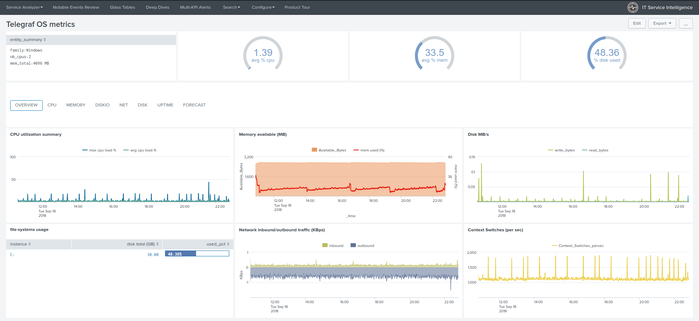

# ITSI Module for Influxdata Telegraf Operating System metrics

| branch | build status |
| ---    | ---          |
| master | 

Copyright 2018-2019 Guilhem Marchand

Licensed under the Apache License, Version 2.0 (the "License");
you may not use this file except in compliance with the License.
You may obtain a copy of the License at

http://www.apache.org/licenses/LICENSE-2.0

Unless required by applicable law or agreed to in writing, software
distributed under the License is distributed on an "AS IS" BASIS,
WITHOUT WARRANTIES OR CONDITIONS OF ANY KIND, either express or implied.
See the License for the specific language governing permissions and
limitations under the License.

#### This application is also officially available on Splunk Base:

https://splunkbase.splunk.com/app/4194

#### The documentation for Nmon Performance Monitor is available online at:

https://da-itsi-telegraf-os.readthedocs.io/en/latest

