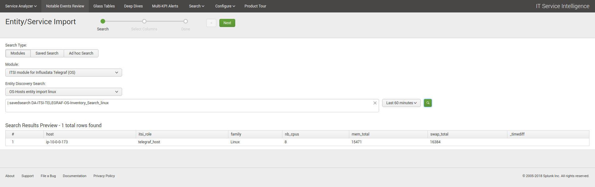
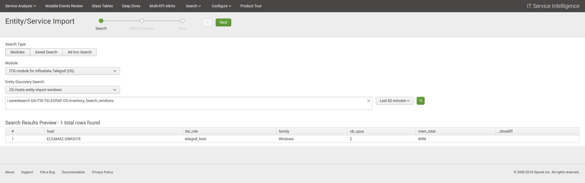

Entities discovery
==================

**The ITSI entities discovery is a fully automated process that will discover and properly configure your entities in ITSI depending on the data availability in Splunk.**

Entities automatic import
#########################

**In a nutshell, the following reports are automatically scheduled:**

* DA-ITSI-TELEGRAF-OS-Inventory_Search_linux
* DA-ITSI-TELEGRAF-OS-Inventory_Search_windows

**When entities are discovered, these will be added automatically with the informational field:**

* itsi_role=telegraf_host

This main information, in addition with the family of the Operating System, is used to automatically provide the relevant entity health page view in ITSI.

Manual entities import
######################

**It is possible to manually import the entities in ITSI, and use the searches above:**

*Configure / Entities / New Entity / Import from Search*

Then select the module name, and depending on your needs the relevant search.

**Linux hosts discovery:**

**Windows hosts discovery:**

