Telegraf Health view
====================

**Through builtin ITSI deepdive links, you can automatically and easily access to the rich Telegraf OS views.**

View for Linux OS
#################

.. image:: img/main_linux.png
   :alt: main_linux.png
   :align: center

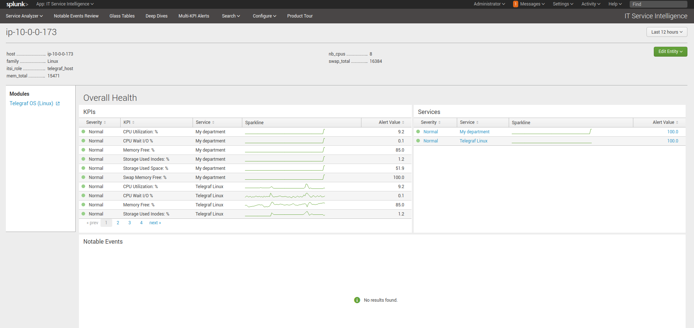

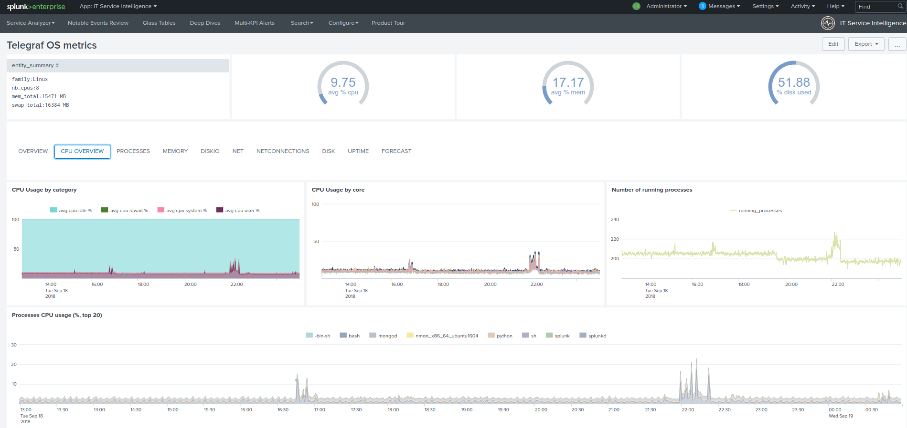

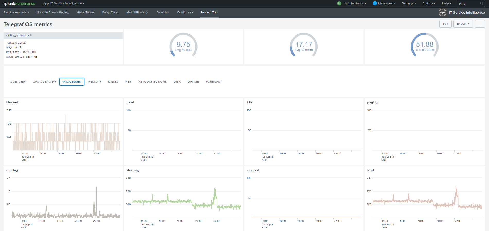

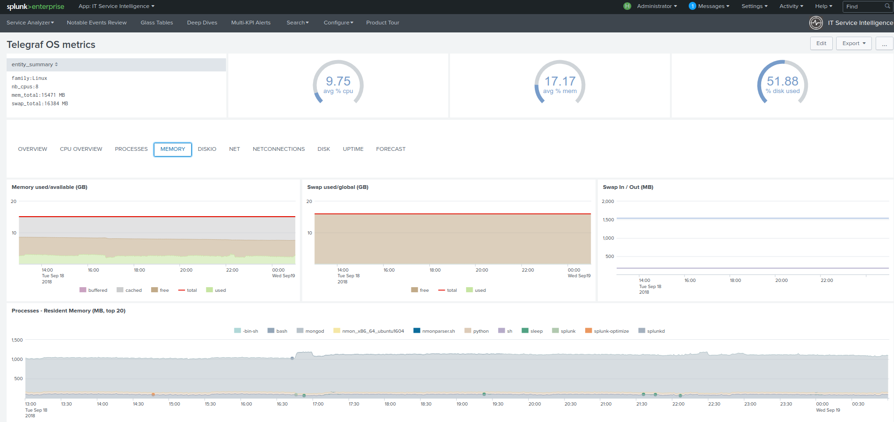

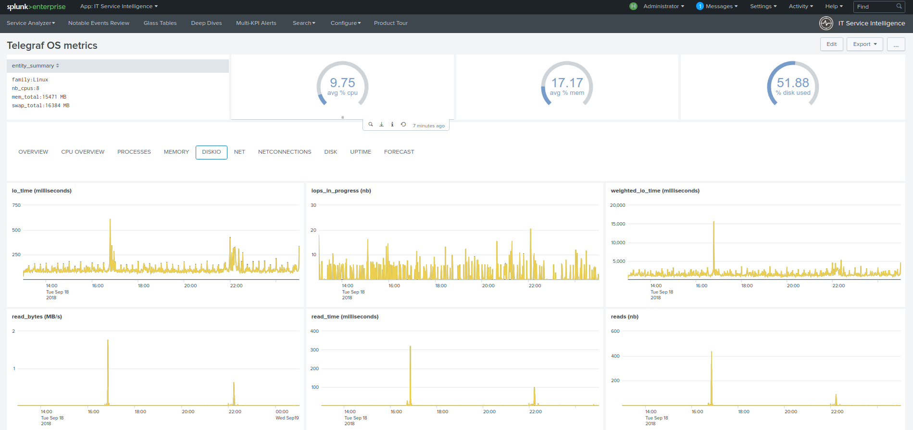

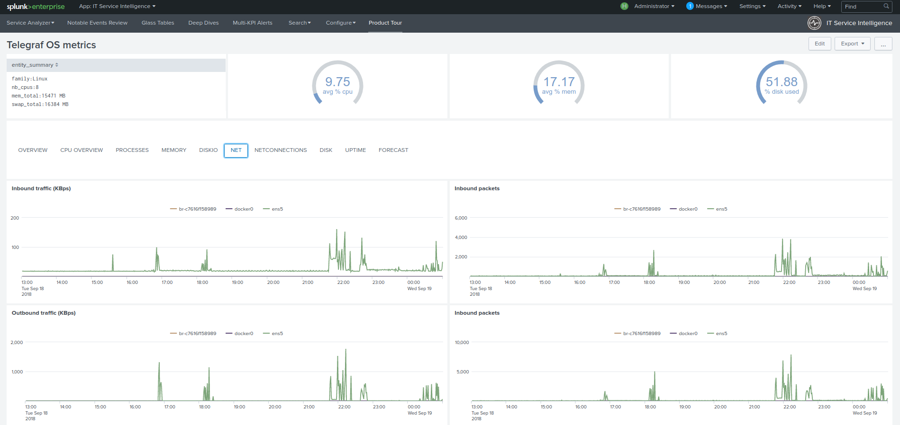

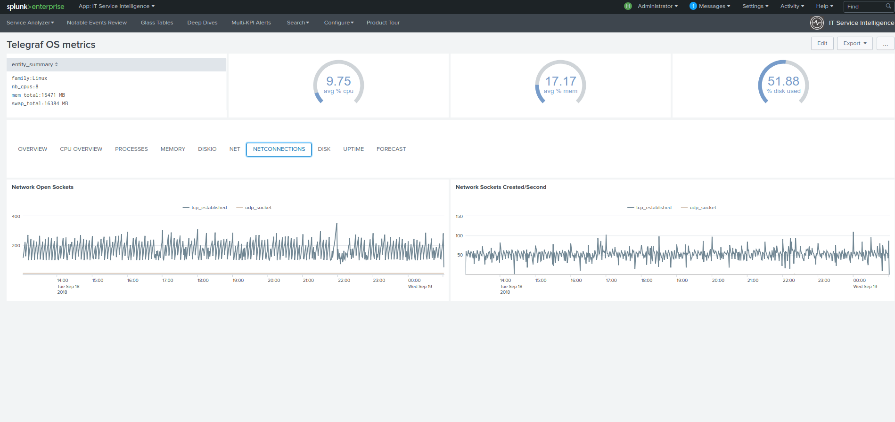

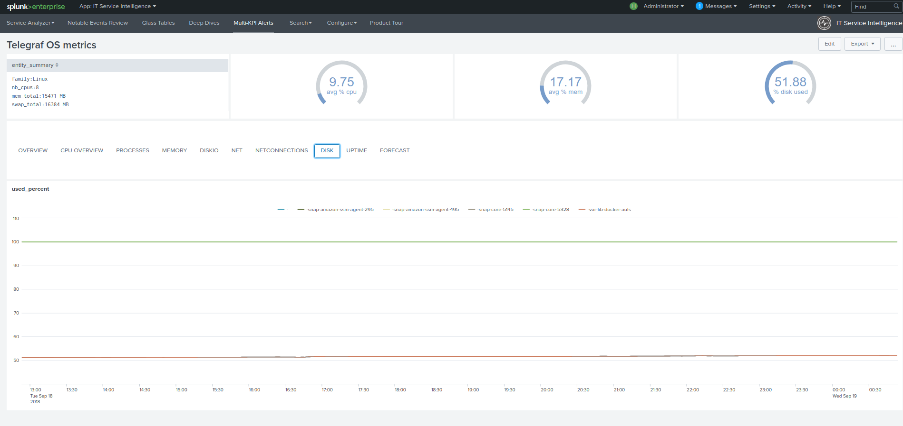

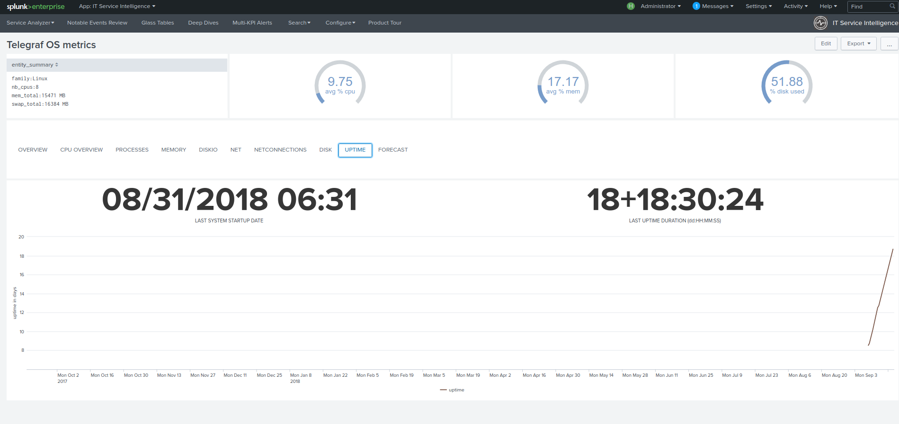

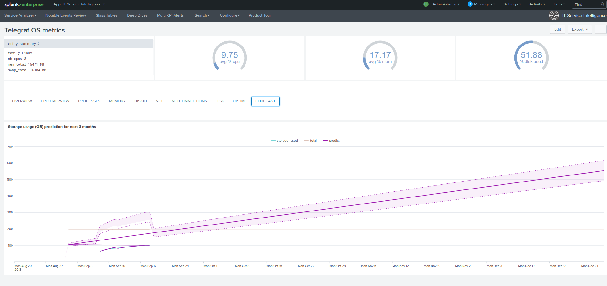

View for Windows OS
###################

.. image:: img/main_windows.png
   :alt: main_windows.png
   :align: center

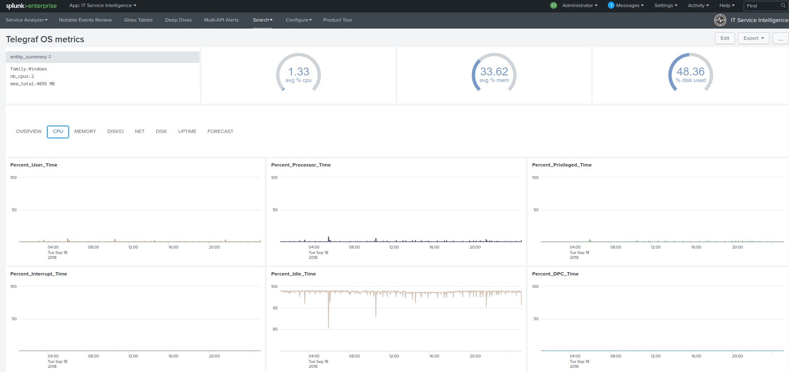

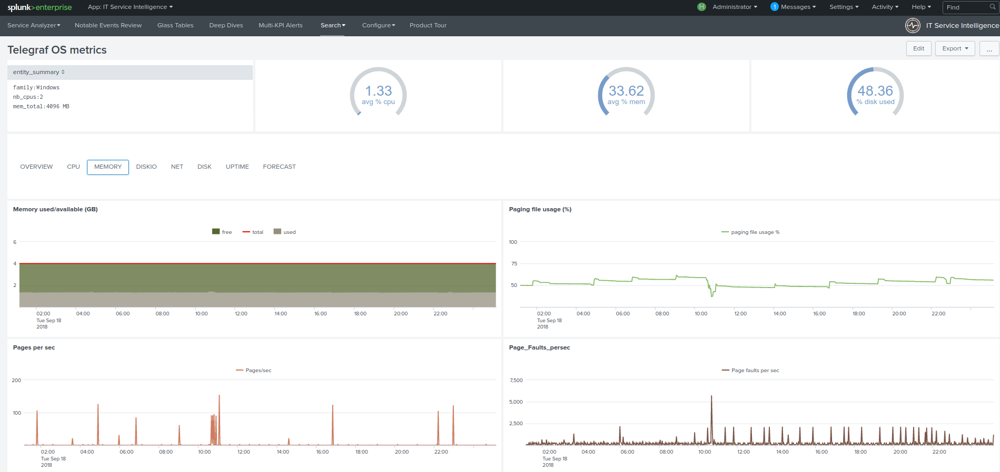

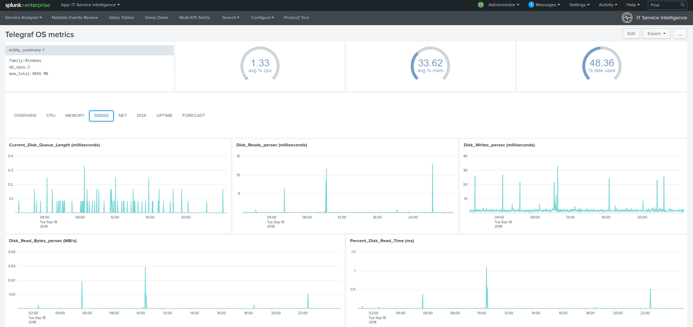

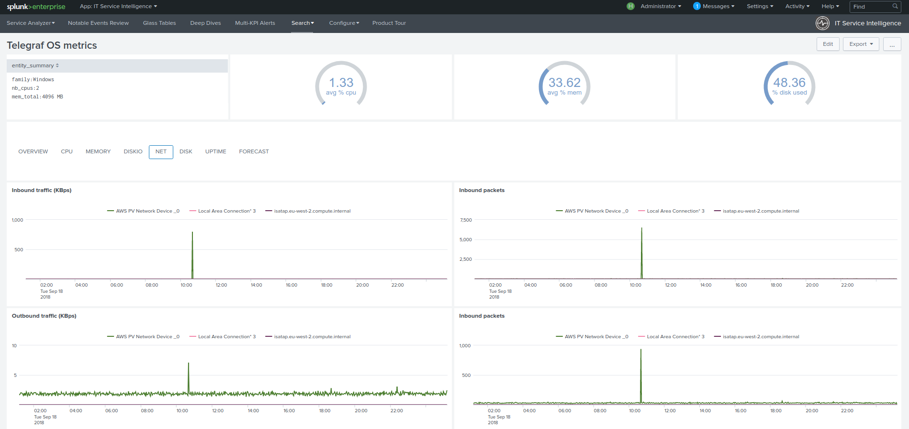

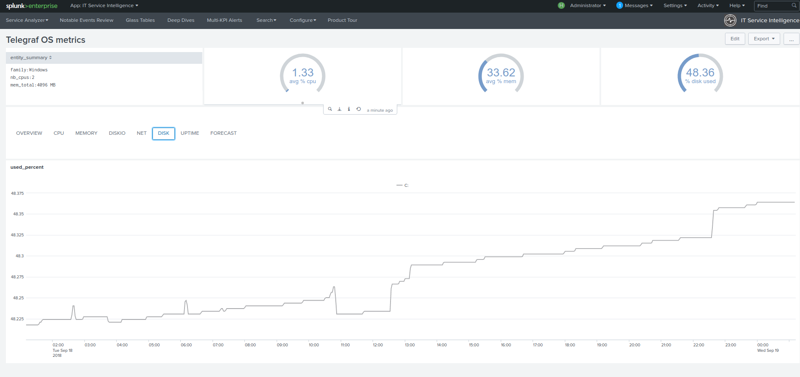

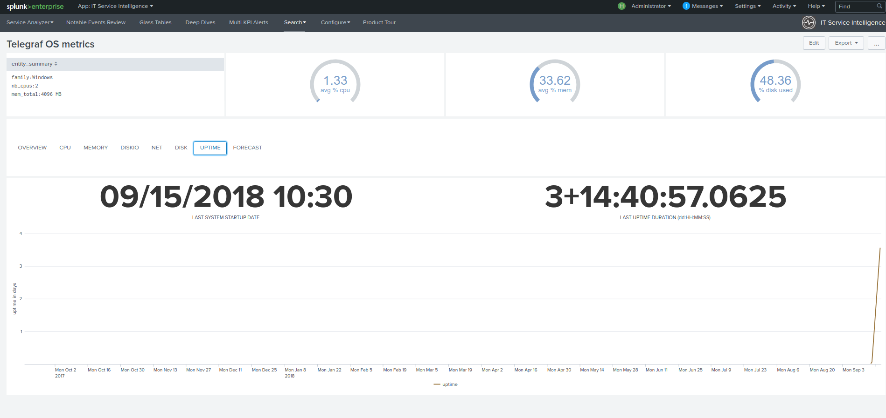

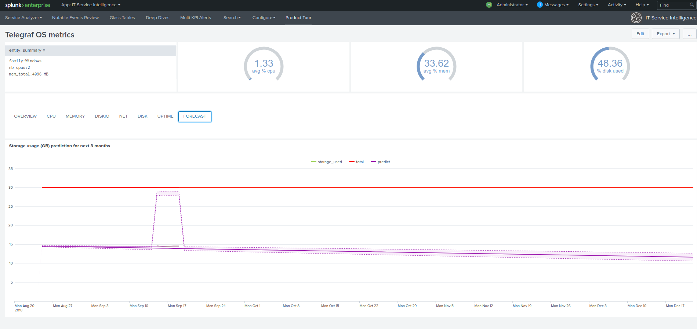

