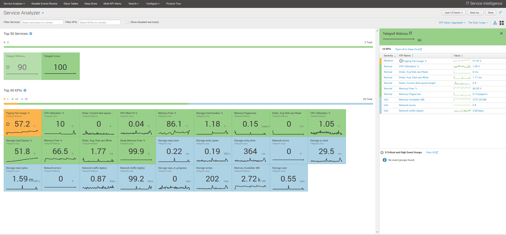
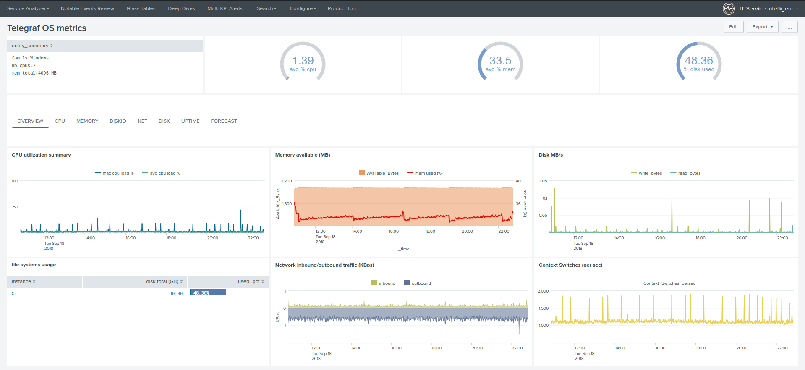

.. DA-ITSI-TELEGRAF-OS documentation master file, created by
   sphinx-quickstart on Tue Sep 18 23:25:46 2018.
   You can adapt this file completely to your liking, but it should at least
   contain the root `toctree` directive.

Welcome to DA-ITSI-TELEGRAF-OS's documentation!
===============================================

ITSI module for Telegraf metrics for Operating Systems.

.. image:: img/main_linux.png
   :alt: main_windows.png
   :align: center

Overview:
=========

.. toctree::
   :maxdepth: 2

   about
   compatibility
   knownissues
   support

Deployment and configuration:
=============================

.. toctree::
   :maxdepth: 2

   deployment
   telegraf
   service_creation

Troubleshoot:
=============

.. toctree::
   :maxdepth: 2

   troubleshoot

Versioniong and build history:
==============================

.. toctree::
   :maxdepth: 1

   releasenotes
