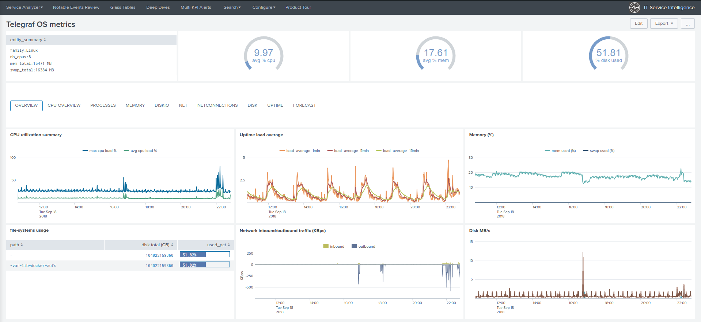

.. DA-ITSI-TELEGRAF-OS documentation master file, created by
   sphinx-quickstart on Tue Sep 18 23:25:46 2018.
   You can adapt this file completely to your liking, but it should at least
   contain the root `toctree` directive.

Welcome to the ITSI module for Telegraf OS documentation!
=========================================================

Telegraf is the famous and powerful plugin-driven server agent for collecting and reporting metrics by Influxdata.

The ITSI module for Telegraf OS brings the power of Telegraf to ITSI and provides builtin entities discovery, services templates and KPI base searches, and rich entity health views.

.. image:: img/screen001.png
   :alt: screen001.png
   :align: center

.. image:: img/main_windows.png
   :alt: main_windows.png
   :align: center

Overview:
=========

.. toctree::
   :maxdepth: 2

   about
   compatibility
   knownissues
   support
   download

Deployment and configuration:
=============================

.. toctree::
   :maxdepth: 2

   deployment
   telegraf
   entities
   service_creation
   health_view

Troubleshoot:
=============

.. toctree::
   :maxdepth: 1

   troubleshoot

Versioniong and build history:
==============================

.. toctree::
   :maxdepth: 1

   releasenotes
